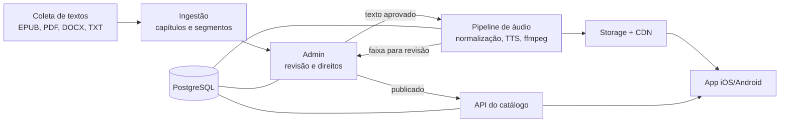
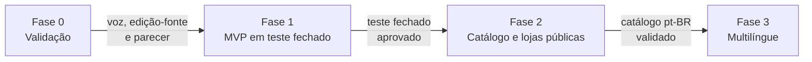

# Plataforma de audiolivros espíritas: especificação

Oct 5, 2026 · @Ricardo

> **Nome atualizado em 06/10/2026:** a marca passou a ser **Centelhar** (domínio centelhar.com.br; mascote "Clara, a pequena centelha"). Este texto é anterior à mudança; onde disser "Centelha" como marca, leia Centelhar. Ver [a definição](CENTELHAR_Alteracao_de_Nome_e_Arquitetura_da_Marca.md) e o [ADR 0007](../../docs/decisoes/0007-marca-centelhar.md).

*Versão 2 (5 out. 2026): nome do app definido como Centelha, mascote Clara e nova seção de [Monetização](#monetização).*

## Visão geral

A plataforma transforma obras espíritas em domínio público em audiolivros gratuitos, publicados em um app para iOS e Android. O lançamento é em português do Brasil; o sistema nasce preparado para outros idiomas sem retrabalho no modelo de dados.

Objetivos:

- Facilitar o estudo da doutrina para quem tem pouco tempo de leitura ou dificuldade visual.
- Publicar apenas conteúdo com direitos verificados, controlado no próprio sistema.
- Manter o custo por obra baixo o bastante para cobrir toda a codificação de Kardec.

## Nome do aplicativo

Nome definido em 5 de outubro de 2026: **Centelha**: remete à centelha divina, conceito espírita literal (a fagulha que se desprendeu do Criador), tem sentido de luz e rende um mascote natural. Pouco disputado no nicho — só apareceu um app de igreja com nome parecido. Aceita as sub-marcas Kids e Jovem. Nas lojas, o subtítulo completa a busca, ex.: "Centelha: audiolivros espíritas". Atenção: "centelha" muda em cada idioma (spark, chispa, étincelle), então o nome não viaja — avaliar na fase multilíngue. Ainda falta a conferência formal.

| Nome | Estilo | Por que considerar |
| --- | --- | --- |
| Lumen | Curto, internacional | Luz em latim; Lumen Kids e Lumen Jovem soam naturais |
| Aurora | Curto, internacional | Renovação, novo começo |
| Elo | Curto, internacional | Ligação entre os planos; fácil de lembrar |
| Alma | Curto, internacional | Igual em português e espanhol |
| Candeia | Evocativo pt-BR | A luz que não se esconde, imagem evangélica |
| Farol | Evocativo pt-BR | Orientação; fácil para crianças entenderem |
| Semear | Evocativo pt-BR | Aprendizado que cresce; bom para o público infantil |
| Caminho Espírita | Evocativo pt-BR | Conversa com o roteiro de estudo por fases |
| Ouvir Kardec | Explícito | Diz exatamente o que o app faz |
| Voz Espírita | Explícito | Bom para busca nas lojas |
| Escuta Espírita | Explícito | Bom para busca nas lojas |

Evitar títulos de obras conhecidas (Nosso Lar, Pão Nosso), que confundem e podem ser marca das editoras.

Antes de decidir, para cada finalista:

- [ ] Busca de marca no INPI
- [ ] Nome livre na App Store e no Google Play
- [ ] Domínio .com.br disponível
- [x] Decisão final do nome

### Nomes descartados por colisão

Busca de apps feita em outubro de 2026; os nomes abaixo saíram da disputa.

| Nome | Motivo |
| --- | --- |
| Candeia | Já é um app espírita no Google Play, ligado a loja de livros com acervo de Kardec, Chico Xavier e Divaldo |
| Lumen | Já existe o Lumen Reader: Audiobooks na App Store, com conceito quase idêntico (domínio público, importa EPUB e PDF, sincronia por iCloud) |
| Semear | Nome muito usado no agro (gestão de solo e nutrição de plantas), vários apps nas duas lojas; busca puxa para o lado errado |
| Elo | Marca forte de bandeira de cartão brasileira, com vários apps oficiais; risco alto no INPI e disputa de busca |
| Voz Espírita, Escuta Espírita | Campo espírita lotado (Espirita.app, App dos Espíritos, EspiritismoPlay); pouca diferenciação |
| Aurora | Marca de alimento no Brasil (frigorífico grande); confunde e divide identidade |
| Lumi | Campo lotado e temático: Lumi AI Bedtime Stories gera histórias infantis narradas com ilustração por IA, mais Lumi Read e Lumina for Kids |
| Farol | Campo lotado (vários apps de igreja e educação); diferenciação fraca |
| Luz (e variantes diretas) | Já há Luz da Luz (audiolivros espíritas gratuitos), Seara de Luz e Portal Luz Espírita |

Finalistas limpos, sem colisão aparente no nicho: Aurora (recomendado), Alma e Farol. Os três ainda precisam da conferência formal no INPI, nas lojas e de domínio.

### Nome do mascote

O mascote é uma pequena luz que acompanha as crianças nos questionários das versões infantil e juvenil. O nome dele é separado do nome do app: pode ser comum ou já usado por outros apps, porque o mascote não precisa de registro próprio nas lojas nem disputa busca. Mascote definida em 5 de outubro de 2026: Clara, apresentada como "Clara, a luzinha do Centelha". As demais opções ficam só como registro.

| Nome | Observação |
| --- | --- |
| Clara (recomendado) | Nome de gente, caloroso, cria vínculo; evoca clareza e luz; funciona em português, espanhol, italiano e inglês. Serve bem como mascote, mas não como nome de app (colide com a fintech Clara e outros) |
| Luce | "Luz" em italiano; também nome próprio, bonito e internacional |
| Clari | Diminutivo fofo de clareza, soa de personagem |
| Faísca | Curto e vivo; combina com a ideia de centelha, mas muda de idioma para idioma |
| Centelhinha | Diminutivo direto de Centelha; afetuoso e liga o mascote ao nome do app |

O nome do app continua Centelha; o mascote ganha um desses nomes.

## Escopo do MVP

O MVP publica duas obras de Kardec em pt-BR, com uma voz, em teste fechado nas lojas. O resto do catálogo entra depois que o pipeline estiver validado.

| Ordem | Obra | Ano original | Fase |
| --- | --- | --- | --- |
| 1 | O Evangelho Segundo o Espiritismo | 1864 | MVP |
| 2 | O Livro dos Espíritos | 1857 | MVP |
| 3 | O Que é o Espiritismo | 1859 | Catálogo 1 |
| 4 | O Livro dos Médiuns | 1861 | Catálogo 1 |
| 5 | O Céu e o Inferno | 1865 | Catálogo 1 |
| 6 | A Gênese | 1868 | Catálogo 1 |
| 7 | Obras Póstumas | 1890 | Catálogo 2 |
| 8 | Léon Denis e Gabriel Delanne | vários | Catálogo 2 |

Regra de direitos: os originais franceses são de domínio público, mas cada tradução tem direito próprio, que no Brasil dura 70 anos após a morte do tradutor. A tradução de Guillon Ribeiro (falecido em 1943) é a candidata natural para o pt-BR. O sistema só permite publicar uma edição com tradutor e status de direitos cadastrados.

Fora do MVP: obras psicografadas por Chico Xavier e Divaldo Franco, que exigem licença das editoras.

## Arquitetura

O admin é a porta única de publicação: coleta e ingestão alimentam a revisão, e só o que for aprovado vira áudio e chega ao app.

O pipeline devolve cada faixa ao admin para revisão de áudio antes de a API expô-la; o PostgreSQL guarda texto, metadados e direitos e é lido pelo admin, pelo pipeline e pela API.

## Modelo de dados

A obra é independente de idioma; tudo que tem idioma fica na edição. Assim, adicionar espanhol ou inglês é criar novas edições da mesma obra, sem mudar o esquema.

| Entidade | Campos principais | Observação |
| --- | --- | --- |
| Obra | id, autor, título original, ano, idioma original | Ex.: Le Livre des Esprits, 1857 |
| Edição | obra\_id, idioma (BCP 47, ex. pt-BR), tradutor, fonte, status de direitos | Uma por tradução e idioma |
| Direitos | edição\_id, falecimento do tradutor, base legal, documento anexo, aprovado por | Bloqueia publicação se pendente |
| Capítulo | edição\_id, ordem, título, referência canônica | Referência liga capítulos entre idiomas |
| Segmento | capítulo\_id, ordem, tipo (parágrafo, pergunta, resposta, nota), texto, número da questão | Unidade de áudio e de navegação |
| Voz | idioma, motor de TTS, id da voz, papel (narrador, pergunta, resposta) | Várias vozes por idioma |
| Faixa de áudio | capítulo\_id, voz\_id, URL, duração, marcações de tempo por segmento, versão | Regenerar cria nova versão |
| Pronúncia | idioma, termo, grafia fonética ou SSML | Dicionário por idioma |

A referência canônica (ex.: "LE-150" para a questão 150 de O Livro dos Espíritos) permite ao app trocar de idioma e cair no mesmo ponto da obra.

## Pipeline de áudio

Cada capítulo vira um job independente na fila, o que permite gerar em paralelo e regenerar só o que mudou.

1. Normalização do texto pt-BR: números romanos ("Capítulo XVII" → "capítulo dezessete"), abreviações, datas e notas de rodapé (lidas ao fim do parágrafo ou omitidas, configurável por edição).
2. Dicionário de pronúncia aplicado via SSML: Kardec, perispírito, Erasto, Fenélon e outros nomes franceses.
3. Síntese por segmento, com vozes distintas para pergunta e resposta em O Livro dos Espíritos.
4. Pós-produção com ffmpeg: pausas entre segmentos, loudness padronizado (−16 LUFS para mobile) e codificação AAC.
5. Marcações de tempo por segmento, salvas na faixa, para a leitura acompanhada no app.
6. Revisão humana por amostragem antes de publicar.

Escolha do motor de TTS: gerar o mesmo capítulo em 2 ou 3 opções e decidir pela escuta.

| Opção | Qualidade pt-BR | Custo | Observação |
| --- | --- | --- | --- |
| Azure Neural TTS | Alta | Por caractere | SSML completo, várias vozes pt-BR |
| Google Cloud TTS | Alta | Por caractere | SSML completo |
| ElevenLabs | Muito alta | Por caractere, mais caro | Voz mais natural; verificar termos de uso comercial |
| Piper (open source) | Média | Servidor próprio | Sem custo variável; menos expressivo |

O custo depende do volume total de caracteres; vale medir o texto das obras do MVP antes de fechar o motor.

## Admin (CMS)

O admin é o ponto de controle: nada chega ao app sem passar pelos estados abaixo, e qualquer reprovação volta o capítulo um passo.

1. Importado: texto coletado ou enviado (EPUB, PDF, DOCX, TXT).
2. Texto revisado: estrutura, capítulos e segmentos conferidos lado a lado com a fonte.
3. Áudio gerado: job concluído, faixa disponível para escuta no próprio admin.
4. Áudio revisado: escuta por amostragem; erros de pronúncia viram entradas no dicionário e o trecho é regenerado.
5. Publicado: liberado na API, só se a edição tiver direitos aprovados.

Papéis:

| Papel | Pode |
| --- | --- |
| Administrador | Tudo, inclusive aprovar direitos e publicar |
| Revisor de texto | Editar segmentos, aprovar texto |
| Revisor de áudio | Ouvir, apontar erros, editar dicionário, aprovar áudio |

Funções de apoio: histórico de versões por capítulo, painel de custo de TTS por obra e log de quem publicou o quê.

## App mobile

Um único código em Flutter (ou React Native) atende iOS e Android; o MVP funciona sem login, com progresso salvo no aparelho.

Funções do MVP:

- Catálogo por obra e capítulo, com busca por número de questão.
- Player com reprodução em segundo plano, controles na tela de bloqueio, velocidade de 0,75x a 2x e timer de sono.
- Download de capítulos ou da obra inteira para ouvir offline.
- Retomar de onde parou e marcadores.
- Leitura acompanhada: texto do segmento destacado enquanto o áudio toca.

Depois do MVP: conta para sincronizar entre aparelhos, planos de estudo (seguindo o roadmap de leitura), compartilhamento de trechos e Android Auto / CarPlay.

Publicação:

- Contas de desenvolvedor Apple (anual) e Google Play (taxa única).
- Teste fechado via TestFlight e teste interno do Google Play antes da loja pública.
- Informar no app e na descrição da loja que a narração é gerada por voz sintética, e creditar autor, tradutor e fonte de cada edição.
- Política de privacidade mesmo sem login, por causa de analítica e downloads.

## Internacionalização

O pt-BR vai primeiro; cada idioma novo exige só três coisas: uma edição com direitos livres, vozes e dicionário de pronúncia daquele idioma, e a tradução da interface do app.

| Candidato | Por quê | Ponto de atenção |
| --- | --- | --- |
| Francês | Textos originais de Kardec, sem tradução envolvida | Nenhum de direitos nos originais |
| Espanhol | Grande público espírita na América Latina | Achar tradução em domínio público |
| Inglês | Alcance global | Achar tradução em domínio público |

Preparar desde já:

- Toda string da interface do app em arquivos de tradução, nunca fixa no código.
- Idioma em formato BCP 47 (pt-BR, es, fr, en) em edição, voz e pronúncia.
- Normalização de texto como módulo por idioma (números e abreviações mudam de regra).
- App escolhe o idioma do aparelho por padrão e permite trocar, mantendo a posição pela referência canônica.

Traduzir obras com IA para criar edições novas é possível, mas exige revisão doutrinária; fica como decisão futura.

## Versões infantil e juvenil

Além do texto integral, algumas obras ganham adaptações para crianças e adolescentes. No modelo de dados, cada adaptação é uma nova edição da mesma obra, com um campo de público (adulto, juvenil, infantil) ao lado do idioma.

| Público | Formato | Voz |
| --- | --- | --- |
| Adulto | Texto integral da tradução | Narração sóbria; duas vozes no Livro dos Espíritos |
| Juvenil | Texto adaptado, linguagem atual, capítulos curtos | Narração mais dinâmica |
| Infantil | Histórias curtas com a ideia central de cada tema | Voz calorosa, ritmo mais lento |

Regras:

- Adaptar a partir do original francês ou da tradução de Guillon Ribeiro, para que a adaptação fique livre de direitos de terceiros.
- Rascunho pode ser feito com IA, mas toda adaptação passa por revisão doutrinária e de linguagem antes de publicar; no admin, isso é um estado a mais no fluxo.
- O app ganha um perfil por público; o perfil infantil não mostra textos integrais nem links externos.

Pontos de atenção com crianças:

- Apps voltados a crianças seguem regras próprias nas lojas (Families Policy do Google Play e categoria Kids da Apple), que limitam SDKs de analítica e publicidade.
- A LGPD exige consentimento dos pais para tratar dados de crianças; o mais simples é o perfil infantil não coletar nenhum dado pessoal.
- Sugestão de fase: juvenil e infantil entram depois do catálogo adulto em pt-BR estar validado.

## Monetização

O app continua gratuito, com todo o acervo liberado. A receita vem de três fontes independentes, cada uma ligada ou desligada pelo admin, sem publicar nova versão do app:

| Fonte | Para onde vai o dinheiro | Padrão | Onde aparece |
| --- | --- | --- | --- |
| Apoio ao projeto | Para o projeto, cobrir TTS, servidores e contas nas lojas | Ligado | Perfil adulto e jovem |
| Doação para caridade (Pix) | Direto para a instituição parceira; o projeto não toca no dinheiro | Ligado se houver parceira | Perfil adulto |
| Anúncios | Para o projeto | **Desligado** | Só perfil adulto, nunca durante a reprodução |

A separação entre "apoio" e "caridade" é importante: dinheiro que fica com o projeto não pode ser chamado de caridade. Misturar os dois confunde o usuário e esbarra nas regras das lojas.

### Apoio ao projeto

- Tela "Apoie o Centelha" com valores sugeridos (ex.: R$ 5, R$ 10, R$ 25), pagamento único ou mensal. Apoiar não libera conteúdo: é voluntário.
- Na loja, o caminho seguro é a compra dentro do app (Apple e Google), que fica com uma comissão.
- No Brasil, desde junho de 2026, o acordo da Apple com o CADE permite oferecer pagamento externo ou link para fora do app, com taxa menor que a da compra interna. Isso abre a possibilidade de Pix direto ao projeto; as taxas e o formato exato precisam ser conferidos nas regras da Apple antes de implementar.
- Página de transparência no app e no site: custo mensal (TTS, armazenamento, contas nas lojas) e quanto foi arrecadado. Isso sustenta a confiança e reduz críticas do movimento espírita.
- Quem apoia ganha um selo simbólico e, se os anúncios estiverem ligados, fica sem anúncios.

### Doação para caridade via Pix

- O app exibe a instituição parceira (nome, CNPJ, o que ela faz) e a chave Pix ou QR code **dela**. O Pix cai na conta da instituição, não do projeto.
- Regra da Apple: só entidades sem fins lucrativos aprovadas pela Apple podem arrecadar doações dentro do app, e com Apple Pay. Sem essa aprovação, a arrecadação deve acontecer fora do app (ex.: abrir a página de doação no navegador). Por isso, no iOS, o botão abre uma página web da campanha em vez de mostrar o Pix dentro do app.
- Conferir a regra equivalente no Google Play antes de publicar.
- O admin permite cadastrar mais de uma instituição e trocar a campanha ativa.

#### Campanhas em momentos específicos

Em vez de um pedido de doação permanente, a caridade aparece em campanhas com data de início e fim, ligadas a um momento do ano ou a uma necessidade concreta. Fora das campanhas, fica só um item discreto no menu.

| Momento | Período sugerido | Exemplo de campanha |
| --- | --- | --- |
| Dia do Espiritismo (lançamento de O Livro dos Espíritos, 18 de abril) | 1 semana | Doação para a biblioteca ou o curso de uma instituição parceira |
| Inverno | Maio a julho | Campanha do agasalho |
| Dia das Crianças (12 de outubro) | 2 semanas | Brinquedos ou material escolar para a evangelização infantil |
| Aniversário de Allan Kardec (3 de outubro) | 1 semana | Campanha de divulgação e apoio a instituições |
| Natal | Dezembro | Cestas básicas |
| Emergências (enchentes, desastres) | Enquanto durar | Arrecadação para a instituição que atua no local |

Como funciona:

- No admin, cada campanha tem: título, instituição, meta em reais (opcional), datas de início e fim, texto, imagem e página de doação. Ela liga e desliga sozinha nas datas.
- No app, a campanha ativa aparece como um cartão na tela inicial do perfil adulto, que o usuário pode fechar. Depois de fechado, só volta na próxima campanha.
- Nunca interromper a narração nem mostrar no perfil infantil, mesmo quando a campanha é para crianças (como a do Dia das Crianças, que aparece só para os adultos).
- Limite de no máximo uma campanha ativa por vez e algumas por ano, para não cansar o usuário.
- Encerrada a campanha, publicar o resultado (quanto foi arrecadado e o que foi feito) com dados informados pela instituição. Isso dá credibilidade para a próxima.
- As datas acima são sugestões; o calendário deve ser combinado com a instituição parceira.
- Os vídeos curtos das redes sociais podem anunciar a campanha no mesmo período.

### Anúncios (opcional)

- Desligados por padrão; o admin liga por plataforma e por formato.
- Formatos permitidos: banner discreto no catálogo e na busca. Proibidos: anúncio em tela cheia, áudio, ou qualquer anúncio que interrompa a narração.
- Bloquear categorias sensíveis no painel do provedor (apostas, namoro, bebidas, outras religiões, política, saúde milagrosa).
- **Perfil infantil: nunca.** A categoria Kids da Apple e a Families Policy do Google restringem anúncios de terceiros, e a LGPD exige cuidado redobrado com dados de crianças.
- Ligar anúncios exige consentimento de rastreamento (ATT no iOS, aviso LGPD), atualizar os rótulos de privacidade das lojas e a política de privacidade.
- Atenção: "gratuito e sem anúncios" é o principal diferencial frente aos concorrentes. Recomendação: só ligar se apoio e doações não cobrirem os custos.

### Perfil infantil e app Kids

No perfil infantil não aparece nenhuma das três fontes: nem anúncio, nem apoio, nem Pix. A Apple também determinou que apps da categoria Kids no Brasil não tenham links para concluir transações em sites. Se as regras de um app único ficarem complexas demais, considerar publicar o Centelha Kids como app separado, sem nenhuma monetização.

### No admin

| Configuração | O que controla |
| --- | --- |
| Monetização → Apoio | Liga/desliga, valores sugeridos, compra interna ou link externo |
| Monetização → Caridade | Instituições parceiras (nome, CNPJ, chave Pix, página de doação) e calendário de campanhas com datas, meta e resultado |
| Monetização → Anúncios | Liga/desliga por plataforma, formatos, categorias bloqueadas |
| Transparência | Custos e arrecadação do mês, publicados na página pública |

O app lê essas opções da API do catálogo ao abrir (configuração remota), com o perfil infantil sempre ignorando todas elas.

### Quando entra

- **MVP (teste fechado):** nada de monetização; só a página de transparência com os custos.
- **Fase 2 (lojas públicas):** apoio ao projeto e caridade com a instituição parceira.
- **Depois:** anúncios, apenas se necessário.

Recebimento como pessoa física tem implicações de imposto de renda; vale falar com um contador sobre MEI ou CNPJ antes de ligar o apoio. Isso não é orientação fiscal nem jurídica.

## Stack sugerida

A stack prioriza peças comuns e baratas de operar; cada item pode ser trocado pelo que a equipe já domina.

| Camada | Sugestão | Alternativa |
| --- | --- | --- |
| Backend e API | Python (FastAPI) | Node.js (NestJS) |
| Admin | Next.js ou React Admin | Django Admin |
| Banco de dados | PostgreSQL | — |
| Fila de jobs | Redis + Celery (ou RQ) | Cloud Tasks / SQS |
| Ingestão | Pandoc, PyMuPDF, ebooklib | — |
| Pós-produção | ffmpeg | — |
| Armazenamento | Cloudflare R2 (sem custo de saída) | Amazon S3 |
| CDN | Cloudflare | CloudFront |
| App | Flutter (just\_audio, audio\_service) | React Native (react-native-track-player) |
| Analítica e erros | PostHog, Sentry | Firebase |

Infra inicial: um servidor para API, admin e workers, com o banco gerenciado. Os workers de TTS escalam separadamente só se o motor escolhido rodar localmente (Piper).

## Fases

A entrega vai em quatro fases, e cada uma só começa quando a anterior passa no seu portão; as datas ficam para quando a equipe e o motor de TTS estiverem definidos.

A fase 0 é curta e barata, mas decide o custo e o risco de todo o resto: a voz, a edição-fonte e o parecer jurídico.

## Riscos e pontos em aberto

O maior risco é jurídico, não técnico: publicar uma tradução ainda protegida. Por isso o controle de direitos está dentro do fluxo de publicação.

| Risco | Impacto | Mitigação |
| --- | --- | --- |
| Edição com revisão ou notas recentes protegidas, mesmo com tradução livre | Retirada do conteúdo, notificação | Usar fonte de edição antiga; parecer jurídico antes do lançamento |
| Pronúncia errada de termos doutrinários | Credibilidade com o público espírita | Dicionário de pronúncia e revisão humana |
| Termos de uso do TTS proibirem distribuição do áudio | Ter que regerar tudo | Verificar a licença comercial antes de gerar o catálogo |
| Rejeição na loja por conteúdo sem valor próprio | Atraso no lançamento | Player completo, offline e leitura acompanhada |

Perguntas abertas:

- [ ] Qual edição-fonte da tradução de Guillon Ribeiro será usada?
- [ ] Projeto pessoal ou ligado a alguma instituição espírita (afeta conta nas lojas e parcerias)?
- [ ] Monetização: definir a instituição parceira para o Pix, os valores de apoio e se o projeto terá MEI ou CNPJ (ver seção Monetização)
- [ ] Qual motor de TTS, após o teste de escuta?

## Documentos relacionados

- [Centelha: prompts de logo e mascote](prompts-logo-mascote.md)
- [Centelha: análise de concorrentes](analise-concorrentes.md)
- [Centelha: plano de redes sociais](plano-redes-sociais.md) — atenção à colisão do nome Centelha nas redes (Centelha Divina, Programa Centelha)
- [Centelha: site e landing page](site-landing-page.md) — projeto do www, separado do app e do admin

Regras citadas na monetização:

- [App Review Guidelines da Apple (doações: 3.2.1 vi e 3.2.2 iv)](https://developer.apple.com/app-store/review/guidelines/)
- [Apple anuncia mudanças no iOS no Brasil (acordo com o CADE, jun. 2026)](https://www.apple.com/newsroom/2026/06/apple-announces-changes-to-ios-in-brazil/)
- [Apple oficializa pagamentos externos no Brasil — Tecmundo](https://www.tecmundo.com.br/mercado/413975-apple-oficializa-lojas-externas-no-brasil-e-outros-meios-de-pagamento-na-app-store.htm)
